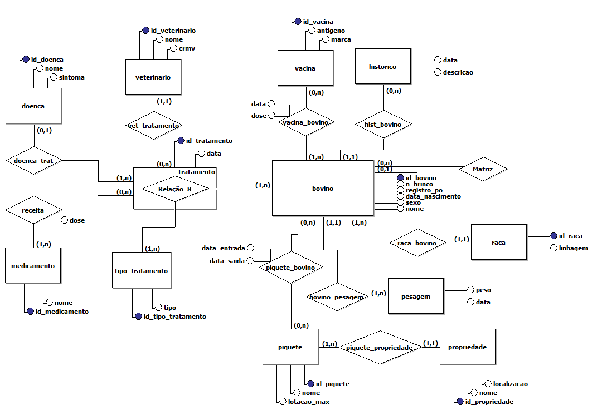
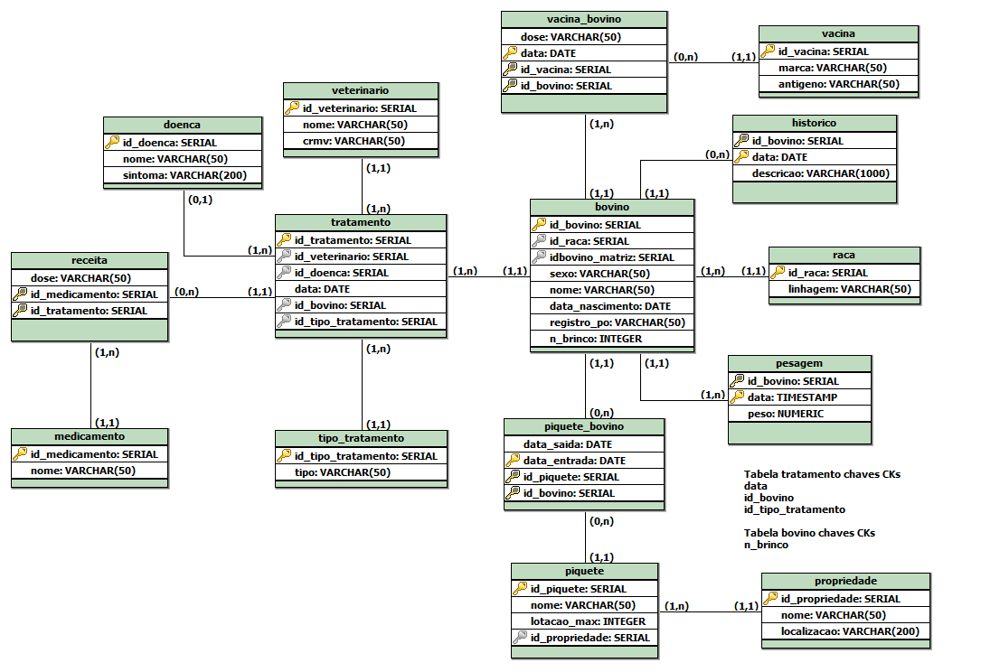

# Sistema de Gerenciamento de Dados para Saúde Bovina (SGDSB)

<p align="center">


Sistema desenvolvido para o gerenciamento da saúde, manejo e acompanhamento de rebanhos bovinos, integrando banco de dados relacional, consultas analíticas, geração de gráficos e Inteligência Artificial Generativa.

</p>

---

# 📖 Sobre o Projeto

O **Sistema de Gerenciamento de Dados para Saúde Bovina (SGDSB)** foi desenvolvido como trabalho final da disciplina de **Banco de Dados** da **Universidade Federal de Santa Catarina (UFSC) – Campus Araranguá**.

O sistema centraliza as informações relacionadas ao manejo pecuário, permitindo controlar propriedades rurais, piquetes, bovinos, tratamentos veterinários, vacinação, histórico clínico e pesagens.

Além das funcionalidades tradicionais de banco de dados, o projeto incorpora recursos de **Inteligência Artificial Generativa (LLMs)** para geração automática de consultas SQL e relatórios técnicos.

---

# 🎓 Informações Acadêmicas

| Informação | Descrição |
|------------|-----------|
| **Universidade** | Universidade Federal de Santa Catarina (UFSC) |
| **Campus** | Araranguá |
| **Disciplina** | Banco de Dados |
| **Professor** | Prof. Dr. Alexandre Leopoldo Gonçalves |
| **Período** | 2026.1 |

## 👨‍💻 Desenvolvedores

- José Henrique Lopes Motta
- Tiago Gonçalves Mengue

---

# 🎯 Objetivos

O projeto foi desenvolvido com o objetivo de:

- Gerenciar propriedades rurais e piquetes;
- Controlar o cadastro e histórico dos bovinos;
- Registrar pesagens, vacinações e tratamentos;
- Automatizar consultas analíticas;
- Gerar gráficos estatísticos;
- Integrar Inteligência Artificial para consultas em linguagem natural (Text-to-SQL).

---

# 🛠 Tecnologias Utilizadas

| Tecnologia | Utilização |
|------------|------------|
| Python 3 | Linguagem principal |
| PostgreSQL | Banco de Dados |
| psycopg2 | Conexão com o banco |
| Pandas | Manipulação de dados |
| Matplotlib | Visualização gráfica |
| Google Gemini | Inteligência Artificial |
| python-dotenv | Variáveis de ambiente |

---

# 🗂 Modelagem do Banco de Dados

A modelagem foi desenvolvida utilizando os conceitos de Modelagem Conceitual e Modelagem Lógica, garantindo integridade referencial e organização dos dados.

## Modelo Conceitual

<p align="center">
    
</p>

---

## Modelo Lógico

<p align="center">
    
</p>

---


# ⚙️ Instalação

## 1. Clone o repositório

```bash
git clone https://github.com/dev-josehenrique/TrabalhoFinalBancoDeDados.git
```

Entre na pasta do projeto:

```bash
cd TrabalhoFinalBancoDeDados
```

---

## 2. Instale as dependências

```bash
pip install pandas matplotlib psycopg2 psycopg2-binary google-generativeai google-genai
```

---

## 3. Crie o banco de dados

```sql
CREATE DATABASE bd_trabalhofinal;
```

---

## 4. Configure a conexão

Edite o arquivo `database.py` com as informações do seu PostgreSQL.

Exemplo:

```python
user="postgres"
password="sua_senha"
host="localhost"
port="5432"
database="bd_trabalhofinal"
```

---

## 5. Configure a API do Gemini

Caso deseje utilizar o módulo de Inteligência Artificial, acesse o arquivo `env.py` na raiz do projeto e insira uma chave api key.

```env
GOOGLE_API_KEY=sua_chave_api
MODEL=gemini-3.1-flash-lite
```

---

## 6. Execute o projeto

```bash
python main.py
```

---

# 🤖 Inteligência Artificial

O projeto possui integração com modelos de linguagem (LLMs), permitindo que perguntas em linguagem natural sejam convertidas automaticamente para consultas SQL.

Entre as funcionalidades disponíveis estão:

- Conversão de perguntas em SQL (Text-to-SQL);
- Consultas pré definidas;
- Apoio à tomada de decisões.

---

# 📁 Estrutura do Projeto

```text
📦 SGDSB
│
├── images
│   ├── modelo-conceitual.png
│   ├── modelo-logico.png
├── crud.py
├── dados.py
├── database.py
├── ddl.sql
├── env.py
├── llm.py
├── main.py
├── README.md
└── relatorios.py

```

---

# 📄 Licença

Este projeto foi desenvolvido exclusivamente para fins acadêmicos como requisito da disciplina de **Banco de Dados** da **Universidade Federal de Santa Catarina (UFSC)**.

---

<div align="center">

### 👨‍💻 Desenvolvido por

**José Henrique Lopes Motta**  
**Tiago Gonçalves Mengue**

**Universidade Federal de Santa Catarina (UFSC)**  
Campus Araranguá • 2026

</div>